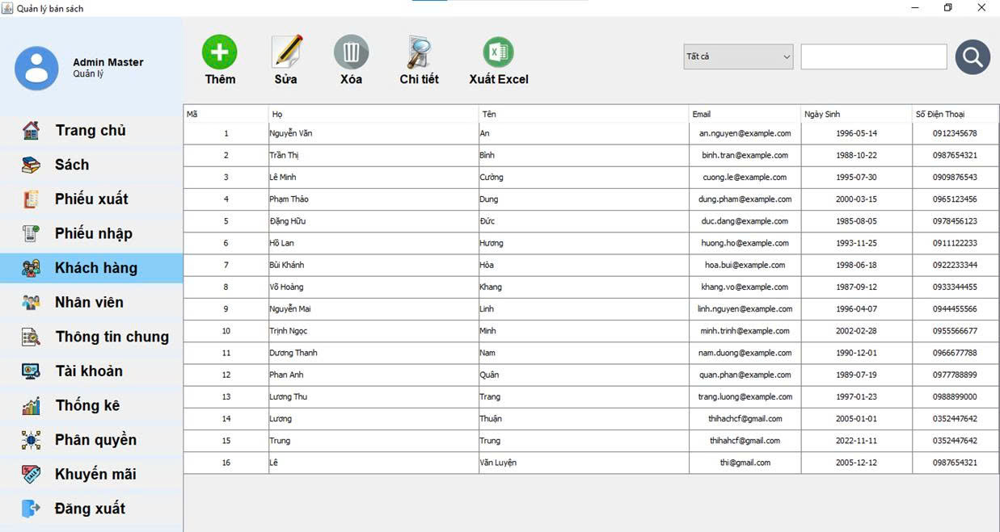

<!-- author: uncletientrung -->
# Đồ án môn Lập trình Java  
# Đề tài: Hệ thống quản lý cửa hàng bán sách
### Thành viên nhóm
 Nguyễn Tiến Trung - 3123410396  <br>
 Nguyễn Minh Thuận - 3123410365  <br>
 Bùi Huy Khải - 3123410145       <br>
 Nguyễn Hải Đăng - 3123410076   
 ### 
 File báo cáo vào slide PowerPoint nằm trong thư mục BaoCaoPTTKHTTT

## Getting Started
1. Tải source code về:

    ```bash
   git clone https://github.com/uncletientrung/QuanLyBanSachJava.git
   ```

2. Mở xampp và vào trang http://localhost/phpmyadmin/ tạo 1 database mới có tên là quanlibansach và import cơ sở dữ liệu trong folder Database -> file quanlibansach.sql trong source code.

3. Sử dụng netbeans để chạy source code.
### Tài khoản Admin
- Username: admin
- Password: 12345
### Giao diện
 
 
 <h4 align="center">Đăng nhập</h4>
 


 <h4 align="center">Trang chủ</h4>
 


 <h4 align="center">Sách</h4>
 


 <h4 align="center">Thêm sách</h4>

 

 <h4 align="center">Sửa sách</h4>

 

 <h4 align="center">Xóa sách</h4>

 

 <h4 align="center">Chi tiết sách</h4>
 


 <h4 align="center">Xuất Excel</h4>
 


 <h4 align="center">Nhập Excel</h4>
 


 <h4 align="center">Bọ lọc</h4>
 


 <h4 align="center">Phiếu xuất</h4>

 

 <h4 align="center">Thêm phiếu nhập</h4>
 


 <h4 align="center">Khách hàng</h4>


 <h4 align="center">Nhân viên</h4>


 <h4 align="center">Thông tin chung</h4>

 

 <h4 align="center">Tài khoản</h4>
 
 <!-- tham khảo hgbaodev -->

 <h4 align="center">Thống kê</h4>


 <h4 align="center">Phân quyền</h4>
 


 <h4 align="center">Phân quyền</h4>


